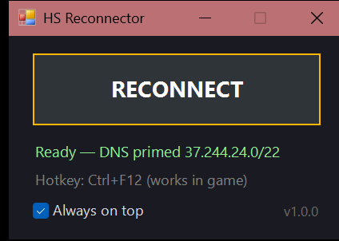

# HS Reconnector: Hearthstone Reconnect Tool for Windows

[](https://github.com/Nykolyn/hearthstone-reconnect-tool/actions/workflows/build.yml)
[](https://github.com/Nykolyn/hearthstone-reconnect-tool/releases/latest)
[](https://github.com/Nykolyn/hearthstone-reconnect-tool/releases)

[](LICENSE)

A free, open-source **Hearthstone reconnect tool**. One click, or **Ctrl+F12** in game, makes
Hearthstone drop its connection and **reconnect to the match in progress**. It is the fastest way
to **skip Battlegrounds combat animations**. It runs on its own and does **not** need Hearthstone
Deck Tracker.



## Download

**[⬇ Download HsReconnector.exe (latest)](https://github.com/Nykolyn/hearthstone-reconnect-tool/releases/latest/download/HsReconnector.exe)**

The file is a single portable exe, about 35 KB, with nothing to install. Every
[release](https://github.com/Nykolyn/hearthstone-reconnect-tool/releases) also includes a zip and
`SHA256SUMS.txt`. You can [verify](#is-the-download-safe) that the exe was built from this source
code.

## Features

- **One-click reconnect.** A small always-on-top window with a big **RECONNECT** button.
- **Global hotkey Ctrl+F12.** Works while Hearthstone is focused, so you never alt-tab mid-fight.
- **Closes only the game-server connection.** The Battle.net session stays up, so there is no
  re-login and no "reconnect failed" screen.
- **Fixes the ~15-second reconnect delay.** Hearthstone freezes for ~15 s on every connect while it
  waits for a reverse-DNS lookup that never answers. HS Reconnector answers it locally, so the
  rejoin takes well under a second. See [how](docs/how-it-works.md#the-15-second-reconnect-delay-reverse-dns).
- **Crash guard.** A 4-second cooldown stops accidental double reconnects, which can crash the game.
- **Small and transparent.** No installer, no network access, no telemetry. The source is about
  1,200 lines of heavily commented C#.

## Requirements

- Windows 10 or 11. The .NET Framework 4.8 it needs is built into Windows 10 1903+ and Windows 11.
- Administrator rights. Windows only lets an elevated program close another program's
  connection, so the app shows a UAC prompt on start.

## Quick start

1. [Download `HsReconnector.exe`](https://github.com/Nykolyn/hearthstone-reconnect-tool/releases/latest/download/HsReconnector.exe).
2. Move it into a folder of its own. `C:\Program Files\HS Reconnector\` is best, because only
   administrators can write there (see [why](SECURITY.md#where-to-keep-the-exe)).
3. Run it and accept the UAC prompt. If Windows SmartScreen says *"Windows protected your PC"*,
   click **More info → Run anyway**. The exe isn't code-signed; see [below](#is-the-download-safe).
4. Start a Battlegrounds game. When combat begins, press **RECONNECT** or **Ctrl+F12**.
   Hearthstone shows *Reconnecting…* and comes back at the end of the fight.

## Status line

| Status | Meaning |
|---|---|
| `Hearthstone: not running` | Start the game. |
| `Hearthstone: running` / `Ready — DNS primed x.x.x.x/22` | Ready. The DNS fix is active for that server range. |
| `Closed 1 — game server x.x.x.x:3724` | Reconnect triggered. |
| `No game-server connection — are you in a match?` | You pressed it outside a match. Nothing was closed. |
| `hosts write blocked — 15s stall stays` | Something, usually an antivirus, blocked the hosts-file write. Reconnect still works, just slower. |
| `Not elevated — restart as admin!` | The app is running without administrator rights. |

## Troubleshooting

| Problem | Fix |
|---|---|
| *Hotkey Ctrl+F12 unavailable (in use)* | Another program already owns Ctrl+F12, for example an HDT reconnect plugin. Close it, or use the button. |
| Reconnect works but takes ~15 s | The hosts-file write was blocked. Allow it in your antivirus, or run [`tools/prime-dns.ps1`](tools/prime-dns.ps1) as administrator. |
| The game crashes after several reconnects in one match | This is a Hearthstone bug. Give it a few seconds between reconnects. |
| The antivirus flags or deletes the exe | Closing connections and editing the hosts file look suspicious to heuristics. Verify the file (below), add an exception, or build it yourself. |

## Is the download safe?

The app needs administrator rights, so don't take the exe on trust. Check it in one of these ways:

- **Build provenance.** Each release is built by GitHub Actions from the tagged commit, with a
  signed [build attestation](https://docs.github.com/actions/security-for-github-actions/using-artifact-attestations).
  With the [GitHub CLI](https://cli.github.com/):
  ```powershell
  gh attestation verify HsReconnector.exe --repo Nykolyn/hearthstone-reconnect-tool
  ```
- **Checksum.** Compare the output of `Get-FileHash HsReconnector.exe` with `SHA256SUMS.txt` from
  the same release.
- **Build it yourself.** See [Building from source](#building-from-source). Compilation is
  deterministic and embeds no machine-specific paths. A byte-identical exe additionally needs
  the exact .NET SDK version the release was built with, which is shown in the workflow log.

[SECURITY.md](SECURITY.md) lists everything the app does with its rights.

## How it works

In short, the app:

1. finds Hearthstone's current game server in its own network log (`GameNetLogger.log`);
2. closes that one TCP connection through the Windows `SetTcpEntry` API;
3. lets Hearthstone rejoin the match by itself.

Port 1119 (Battle.net) and the web ports are never touched. For the full story, including why a
naive reconnect takes 15 seconds and why it seeds whole /22 ranges, read
**[docs/how-it-works.md](docs/how-it-works.md)**.

## What it changes on your PC

- **TCP connections:** only the game-server connection owned by `Hearthstone.exe`.
- **hosts file:** a single block marked `# BEGIN HsReconnector` / `# END HsReconnector` with
  stub names under the reserved `.invalid` domain. The original file is backed up once to
  `hosts.hsreconnector.bak`. Undo it with `tools\prime-dns.ps1 -Remove`, or delete the block.

Nothing else. The app keeps no settings files and makes no network requests.

## FAQ

**Is this a cheat? Can I get banned?**
It doesn't read or modify game memory or files. It closes one network connection, which is the
same thing that happens when your Wi-Fi drops for a moment. Forcing disconnects is still a gray
area in Blizzard's Terms of Service, so use it at your own risk.

**Does it work with Hearthstone Deck Tracker?**
Yes, both run side by side. If you already use HDT, you may prefer the
[HDT plugin version](https://github.com/Nykolyn/hearthstone-reconnect-hdt-plugin), which adds the
button to HDT's overlay instead of a separate window. Use one or the other: only one program can
own Ctrl+F12, and the first one started gets it.

**Mac or Linux?**
No. The tool relies on Windows-only APIs.

**Why does it need admin rights?**
Windows only lets an elevated process close another process's TCP connection, and the hosts
file is admin-only too.

## Building from source

Requires the [.NET SDK](https://dotnet.microsoft.com/download) (8 or newer). No other dependencies.

```powershell
git clone https://github.com/Nykolyn/hearthstone-reconnect-tool.git
cd hearthstone-reconnect-tool
powershell -ExecutionPolicy Bypass -File build.ps1
```

The exe lands in `artifacts\`. `build.ps1 -Package` also creates the release zip and checksums.
The build checks that the exe still requests administrator rights and embeds no path from the
build machine.

## Versioning and releases

The project follows [Semantic Versioning](https://semver.org/). The version lives in one place,
[`Directory.Build.props`](Directory.Build.props), and the app shows it in the bottom-right corner.
Changes are listed in [CHANGELOG.md](CHANGELOG.md).

To publish a release, bump `<Version>` and the changelog, commit, then push a tag
(`git tag v1.2.3 && git push origin v1.2.3`). CI checks that the tag matches, then builds the
exe, attests it, and publishes the GitHub Release.

## Contributing

Bug reports and pull requests are welcome. Please use the
[bug report form](../../issues/new?template=bug_report.yml) and remove personal data from logs.
Report security issues privately; see [SECURITY.md](SECURITY.md).

## Related

- [Hearthstone Reconnect Plugin for HDT](https://github.com/Nykolyn/hearthstone-reconnect-hdt-plugin):
  the same reconnect as a Hearthstone Deck Tracker plugin, with an overlay button.
- [HDT-Reconnector](https://github.com/haoruan/HDT-Reconnector) and
  [HsReconnectTool](https://github.com/Vaiz/HsReconnectTool) use the same `SetTcpEntry` technique.

## Disclaimer

Not affiliated with or endorsed by Blizzard Entertainment. Hearthstone® is a trademark of
Blizzard Entertainment, Inc. Provided "as is", without warranty. See [LICENSE](LICENSE).

## License

[MIT](LICENSE)
